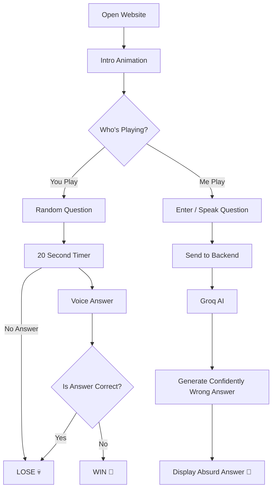

git (1)
Wrong Answers Only! 🎯
Basic Details
Team Name: ZenX
Team Members
Member 1: Ayisha Zahrin - Government Engineering College Kozhikode
Member 2: Sara Ajeeba - Government Engineering College Kozhikode
Project Description:
🤪 Wrong Answers Only

Welcome to the game where being wrong is the whole point! 🎯😂

Think you know the answer? Prove yourself wrong!
Players are challenged with fun questions and must give the most creative, ridiculous, and hilariously incorrect answers they can think of.

🚫 Correct answers? NOPE!
✅ Wrong answers? ABSOLUTELY!
🏆 Funniest answer? YOU WIN!

A simple, chaotic, and entertaining game designed to turn ordinary questions into maximum nonsense and maximum fun! 😂🔥

The Problem (that doesn't exist)
People have been answering questions correctly for far too long. This has caused an alarming shortage of confidently wrong answers, unnecessary knowledge, and absolutely avoidable pillow attacks.

The Solution (that nobody asked for)
Wrong Answers Only is a game where being wrong is the only way to win. Answer questions incorrectly, survive the timer, and use your voice to prove that you have absolutely no idea what you're talking about. And if you let the AI play, it will confidently make things up for you.

Technical Details
Technologies/Components Used
For Software:

Languages used

HTML
CSS
JavaScript

Frameworks used
Node.js
Express.js

Libraries used
dotenv
Web Speech API
Web Audio API

Tools used
VS Code
Git & GitHub
Groq API
Browser Developer Tools

For Hardware:

Main components

Laptop/PC
Microphone
Speakers/Headphones

Specifications

Any modern laptop/PC capable of running Node.js and a modern web browser
Working microphone for voice input
Internet connection for AI-generated answers

Tools required

VS Code
Node.js
Modern web browser
Implementation
For Software:

Installation
npm install

Create a .env file in the project root and add the Groq API key:

GROQ_API_KEY=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

Run
npm start

Then open:

http://localhost:3000

Project Documentation
For Software:

Screenshots 

Diagrams

**Workflow:** The game starts with an intro animation and lets the player choose between **You Play**, where they must answer questions incorrectly using voice recognition, and **Me Play**, where the AI generates confidently wrong answers. A correct answer or no answer results in a loss, while a sufficiently wrong answer wins the game.

Project Demo
Video

https://github.com/user-attachments/assets/a989b34e-959e-4221-9adb-1967767ca0e3
The video demonstrates the complete process of building and testing **Wrong Answers Only**, from developing the game interface and implementing the gameplay logic to testing voice recognition, timers, sound effects, and the AI-powered “Me Play” feature. It also shows the final game being run and tested to make sure everything works as intended.

Made with ❤️ at TinkerHub Useless Projects
